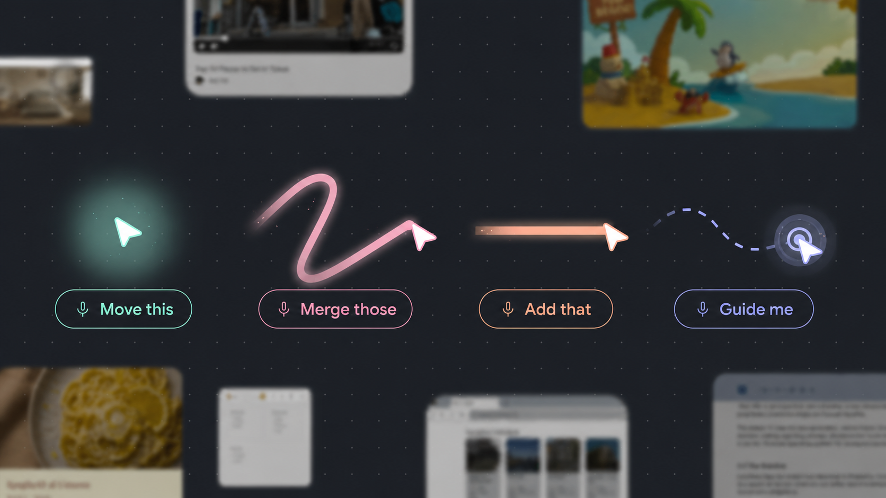

<div align="center">



# TipTour

**Talk to your Mac. Point at anything. Let AI act on it.**

[](./LICENSE)
[](https://www.apple.com/macos)

</div>

TipTour is a macOS menu bar companion that understands your screen, listens to your voice, and controls your computer for you.

Hold the hotkey, say what you want, and TipTour can point, click, type, open apps, edit selected text, or act on a freeform highlighted area.

## What You Can Say

- "Open Google Docs and write a short essay."
- "Change this word."
- "Move this over there."
- "Click the Blank document."
- "Make this line sound softer."
- "Guide me through exporting this."

TipTour sees the app/window you are working in, understands the highlighted or hovered area, and keeps actions inside that context.

## How It Works

TipTour combines:

- **Gemini Live** for realtime voice, screen understanding, transcription, and tool calling.
- **CUA Driver Core** for reliable computer control: clicks, typing, hotkeys, app launch, URLs, scrolling, and browser coordinates.
- **macOS Accessibility** for native app structure and exact text/element targeting.
- **Focus Highlight** for "this part" commands: hold the highlight hotkey, paint over an area, then ask TipTour to edit or act on it.

The app runs from the macOS menu bar. No dock icon, no main window.

## Controls

- **Ctrl + Option**: toggle voice mode.
- **Ctrl + Shift + drag**: paint a freeform focus highlight.
- **Menu bar icon**: open settings, permissions, and mode toggles.

## Modes

- **Autopilot**: TipTour performs actions for you. On by default.
- **Tour Guide**: TipTour teaches step by step. Off by default.
- **Neko Mode**: optional playful cursor mode. Off by default.

## Privacy

TipTour needs macOS permissions to work:

| Permission | Used For |
|---|---|
| Microphone | Voice input |
| Screen Recording | Visual context for Gemini |
| Accessibility | Reading UI structure and controlling apps |
| Screen Content | ScreenCaptureKit capture |

API keys are handled through the Cloudflare Worker proxy for distribution builds. Local development can also use a developer Gemini key stored in Keychain.

## Build From Source

Requirements:

- macOS 14+
- Xcode 16+
- Node 20+ only if working on the Cloudflare Worker

Open the project:

```bash
open tiptour-macos.xcodeproj
```

Then in Xcode:

1. Select the `TipTour` scheme.
2. Set your signing team.
3. Press `Cmd+R`.
4. Grant the requested macOS permissions.

Do not build with terminal `xcodebuild` if you are actively testing permissions, because it can invalidate local TCC permission state.

## Worker

The app uses a Cloudflare Worker proxy so production builds do not ship API secrets.

```bash
cd worker
npm install
npx wrangler secret put GEMINI_API_KEY
npx wrangler deploy
```

## Project Notes

For the deeper technical map, coding conventions, and agent instructions, see [AGENTS.md](AGENTS.md).

## Credits

- [CUA](https://github.com/trycua/cua) for computer-use primitives.
- [Gemini Live](https://ai.google.dev/gemini-api/docs/live-api) for realtime voice, vision, and tool calling.
- [oneko](https://github.com/crgimenes/neko) for optional pixel cat sprites.

## License

[MIT](LICENSE)
